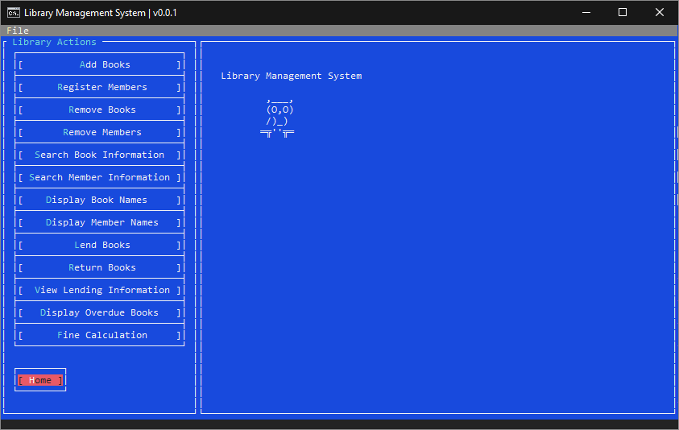
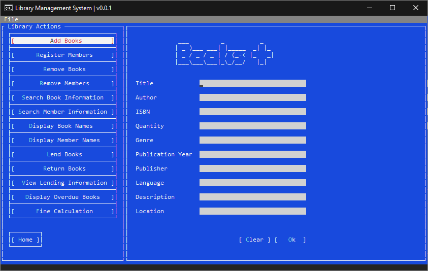
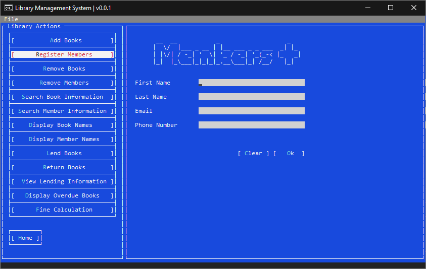

# Library Manager CLI (C#)

A command-line interface (CLI) library management system for efficiently managing books, members, and transactions in your library.

**Note:** This is only for Windows.

---

## How to add Terminal.Gui 

To add Terminal.Gui to the project, follow these steps:

1. Open your terminal or command prompt.

2. Navigate to the project directory.

3. Run the following command:

   ```shell
   dotnet add package Terminal.Gui --version 1.14.0

---

## How to Create an Executable (.exe) File

To create an executable (.exe) file for this project, follow these steps:

1. Open your terminal or command prompt.

2. Navigate to the project directory.

3. Run the following command:

   ```shell
   dotnet publish -c Release -r win-x64

---

## Application GUI





   
